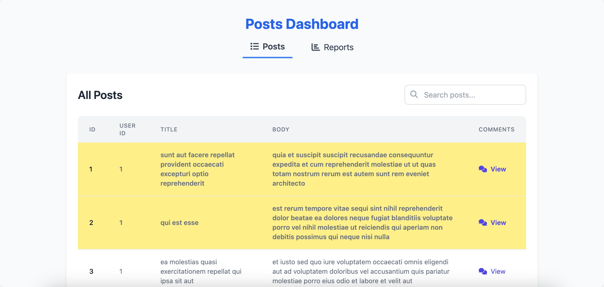
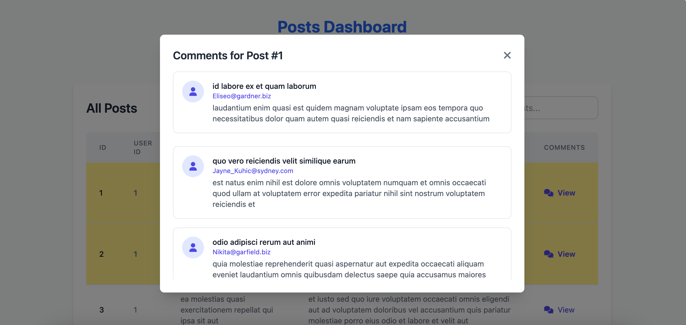
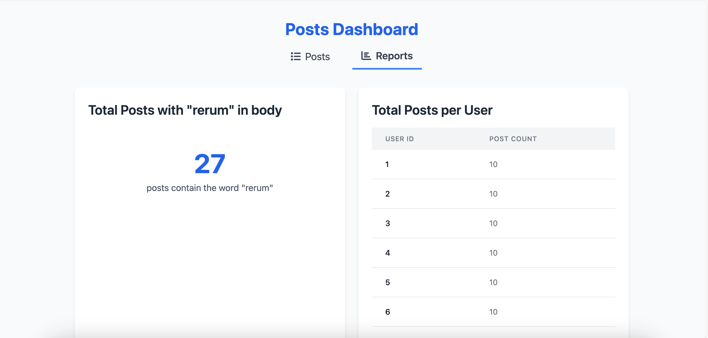

# Post Dashboard

This is a simple dashboard that displays a list of posts build with HTML, CSS, and JavaScript. It uses the [Tailwind CSS](https://tailwindcss.com/) framework for styling.
The dashboard allows users to search for posts by title or body, and view comments for each post. It also displays some basic statistics about the posts, such as the number of posts with the word "rerum" in the body and the number of posts per user.

## Features

- Search posts by title or body
- View comments for each post
- Display basic statistics about the posts

## How to use

To use this dashboard, you just need to open the `index.html` file in your web browser that resides in the `pages` directory.

# Screenshots

